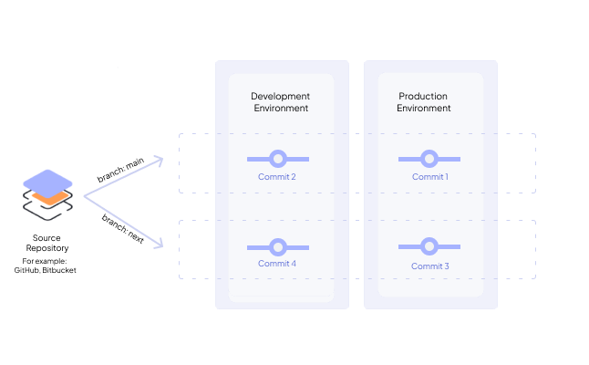
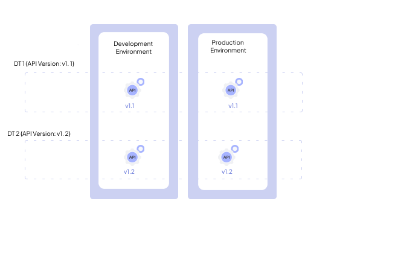

# Deployment Tracks

Deployment Tracks within Choreo are systematically structured pathways for deploying your software components. Each deployment track is Choreo's version of a CI/CD pipeline but enriched with additional capabilities aimed at simplifying developers' deployment management. These tracks ensure that your components, regardless of their origin as source code or prebuilt images, reach their intended destinations seamlessly without encountering obstacles.

The primary aim of Deployment Tracks is simplification. They establish an organized and structured approach that minimizes the chances of errors and challenges that are typically associated with deployment workflows.

## The significance of Deployment Tracks

Deployment Tracks offer practical solutions to enhance the API consumer experience by addressing two critical challenges:

- **Streamlined deployment**: Deployment Tracks serve as ll-designed routes for your software components, enhancing the organization and reliability of the deployment process, similar to a ll-structured express route.

- **Efficient API versioning**: Especially beneficial for managed APIs, Deployment Tracks provide a straightforward method for creating API versions that seamlessly interact with previous iterations. This simplified version management benefits both API creators and consumers alike.

## Streamlined deployments

For streamlined deployments, Choreo dissect two integral approaches that leverage Deployment Tracks: the comprehensive CI/CD integration and the focused CD-Only strategy.

### CI/CD with Deployment Tracks

A deployment track is linked to a particular branch within a GitHub repository. This connection is useful for handling deployments to various environments. On Choreo's Deploy page, you can easily visualize the deployments to specific environments associated with your selected deployment track. Moreover, the deployment track has a functionality that initiates automatic deployments for the linked branch. When activated, merging a pull request (PR) triggers a deployment to the development environment.

{.cInlineImage-half}

### CD-Only strategy with Deployment Tracks

If you're inclined to use your own Continuous Integration (CI) systems and want to harness the deployment track as a Continuous Deployment (CD) pipeline, you can seamlessly link deployment tracks to a container registry repository. This configuration empowers users to effortlessly deploy images sourced directly from the linked container registry repository.

{.cInlineImage-half}

## Efficient API versioning

**This section applies to only service components**. When working with service components in Choreo, it's important to think about API versions. Choreo follows semantic versioning (SemVer), which is widely used in the software industry.

!!! info "What is semantic versioning?"
    In brief Semantic Versioning (SemVer) is a way to number versions that helps everyone understand changes in software. A version number has three parts: Major, Minor, and Patch.
    For example: 1.2.3 (1 is the major, 2 is the minor, and 3 is the patch version)  

    Given a version number MAJOR.MINOR.PATCH, the following rules apply:
    - **MAJOR** version is incremented when you make incompatible API changes.
    - **MINOR** version is incremented when you add functionality in a backward-compatible manner.
    - **PATCH** version is incremented when you make backward-compatible bug fixes

One of the primary concerns when dealing with SaaS APIs is to minimize disruption for API consumers while continuously developing and deploying updates.

In compliance with SemVer, changes that don't introduce breaking or additive modifications to the API are categorized as patch updates. Hover, from the perspective of API consumers, these changes should ideally not disrupt their API clients. Typically, API consumers are most concerned with major API version alterations, but there might be instances where minor version changes are communicated to them.

Therefore, in the context of deployment tracks, API developers only need to specify the major and minor version being delivered from a particular deployment track. This information is treated as the API version attribute of a deployment track. If the publisher requires versioning for internal tracking purposes, this can be accomplished in Git through the use of Git tags, on GitHub with GitHub releases, and so forth.

{.cInlineImage-half}
